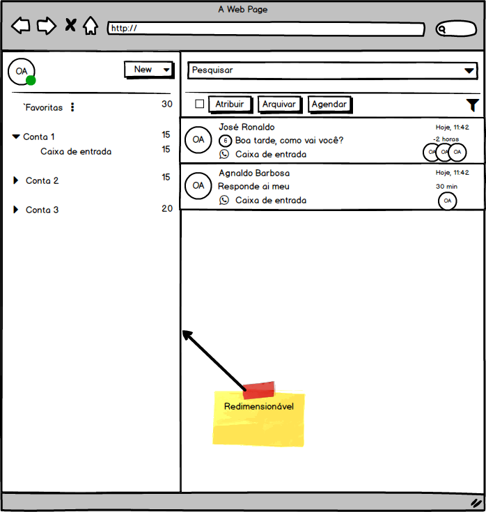
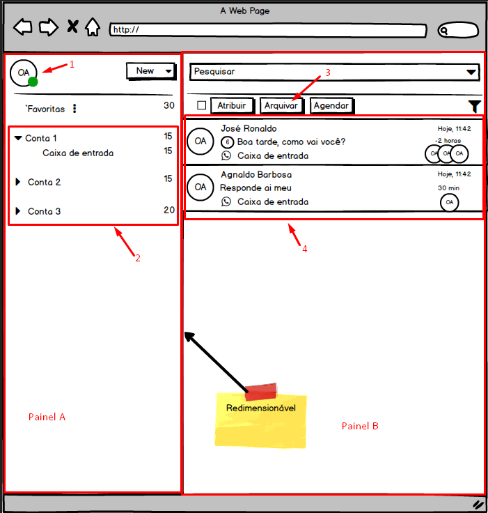
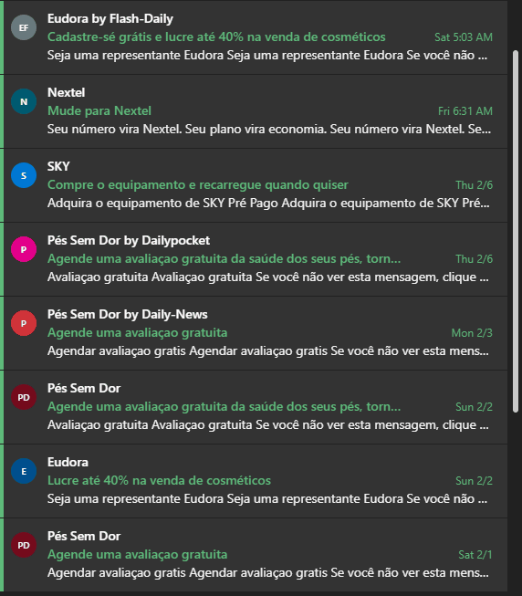

# Teste prático enContact - Frontend

Obrigado por se interessar em participar do teste para desenvolvedor Front-end da [enContact](http://www.encontact.com.br).

## O que estamos procurando

Procuramos alguém para participar do nosso time de desenvolvimento, trazendo expertise na parte de interface de usuário e desenvolvimento front-end.

## O que será avaliado no desafio

O desafio consiste em criar uma pequena aplicação, seguindo os itens abaixo.
Alguns pontos importantes para citar:

* Layout/apresentação visual.
* Cuidados na estrutura da tela.
* Organização e clareza do código.

## Regras/Condições

1. As telas são um rascunho da disposição e apresentação, como você receberia uma análise, monte o layout que achar adequado.
2. Utilize React.js (Preferêncialmente utilizando Typescript).
3. Os dados serão consumidos através de uma api externa.
   1. Detalhes desta API são apresentados em seguida.
4. Utilizar globalização. (Adicionar algum botão para que possa alterar a linguagem).
5. Utilizar tematização. (Adicionar algum botão para que possa escolher o tema: 
Dark ou Ligth).
6. Criar uma tela de login simples
   1. Somente usuário logado poder acessar a Main page.
   2. Não é necessário validar credênciais, pode utilizar login fixo. (Ex. User: Admin, Pass: Admin).

## Componentes / Comportamentos

1. O componente 1 deve:
   1. Ao clicar apresentar um menu para que possa ser feito o Logout.
2. O componente 2 deve:
   1. Listar a arvore de menu a partir dos items obtidos pela api: <http://my-json-server.typicode.com/EnkiGroup/DesafioReactEncontact/menus>
      1. Exemplo:
      * Menu
        * subMenu
        * subMenu
      * Menu
        * subMenu
   2. Ao selecionar um item (subMenu - Caixa de entrada, por exemplo), deve atualizar a listagem representada pelo componente 4, com os itens relacionados ao subMenu.
3. O componente 3 deve:
   1. Ao clicar no botão "Arquivar" os itens selecionados do componente 4 devem ser removidos da listagem.
4. O componente 4 deve:
   1. Apresentar os dados relacionados ao item selecionado no componente 2, através da api:
      ➡️ http://my-json-server.typicode.com/EnkiGroup/DesafioReactEncontact/items/{id do subMenu}
   2. Cada item (Card) deve apresentar as seguintes informações (Exemplo utilizando o primeiro item da imagem):
      1. Name (José Ronaldo -> Primeiro texto)
      2. Subject (Boa tarde, como vai você? -> Segundo texto)
      3. Owner (OA -> Circulo maior com as iniciais)
      4. Users (OA, OA, OA -> Três circulos menores com as iniciais)
      5. OBS: As demais informações do Card podem ser fixas.
   3. Quando o usuário passar o mouse sobre a linha, deve ser apresentada a opção de selecionar o item da lista (Apresentar um checkbox no lugar das iniciais do Owner).
   4. Ao selecionar o item, todas as Iniciais devem ser apresentadas como opção de seleção para permitir multiplas escolhas.
   5. Ao desmarcar todas as opções, o sistema deve voltar a apresentar as Iniciais.
   6. OBS: Segue um exemplo visual do comportamento desejado extraido de um e-mail Office365:

## Finalizando

Qualquer dúvida, fale conosco.

## Agradecimentos

* [Office365](https://office365.com) pela ideia de front-end.